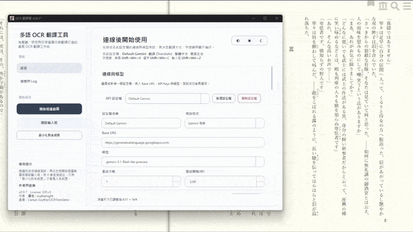
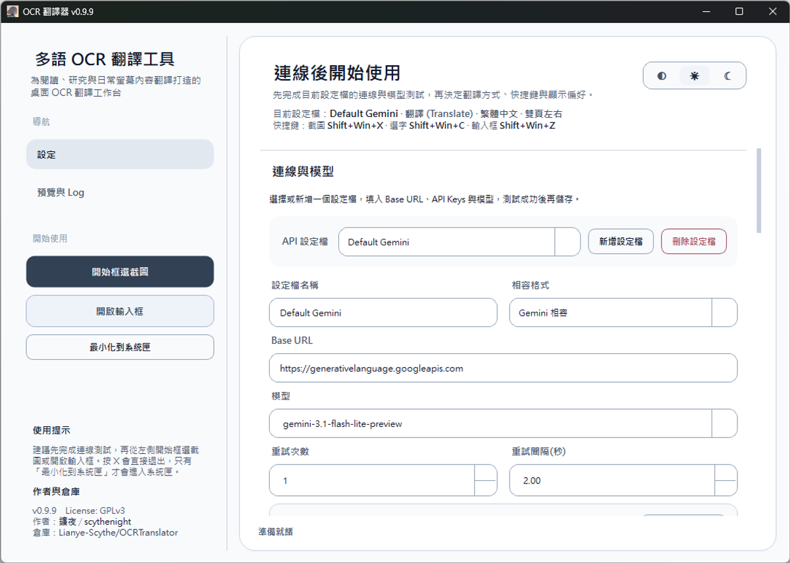
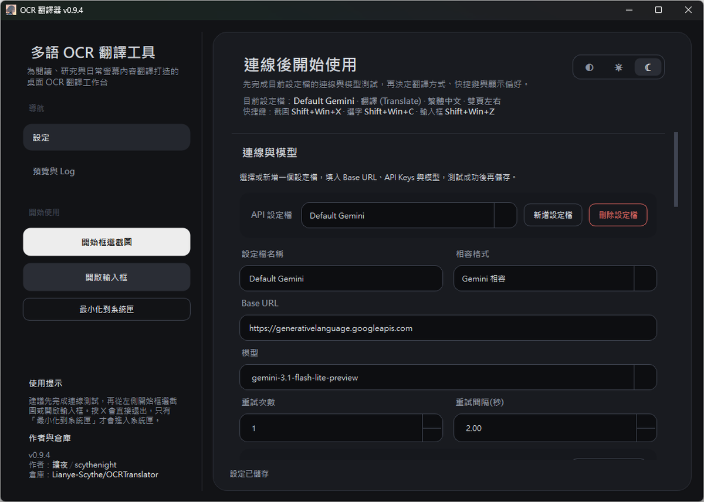
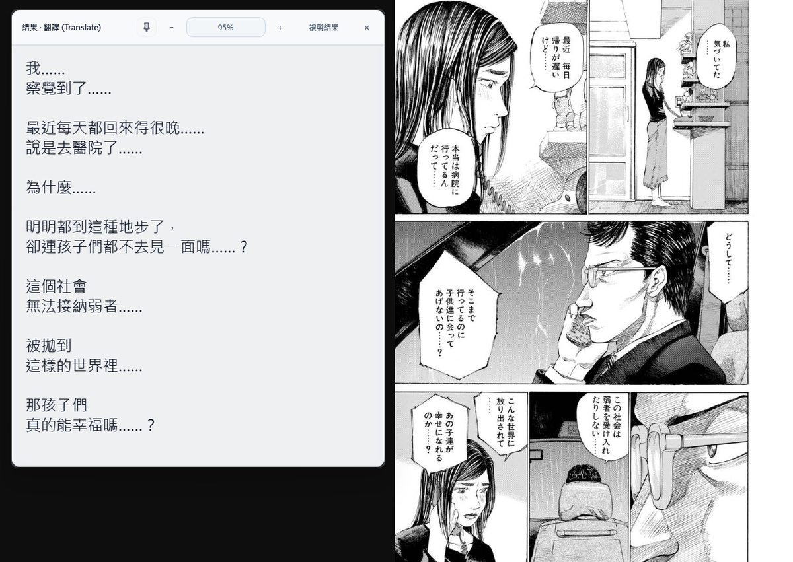
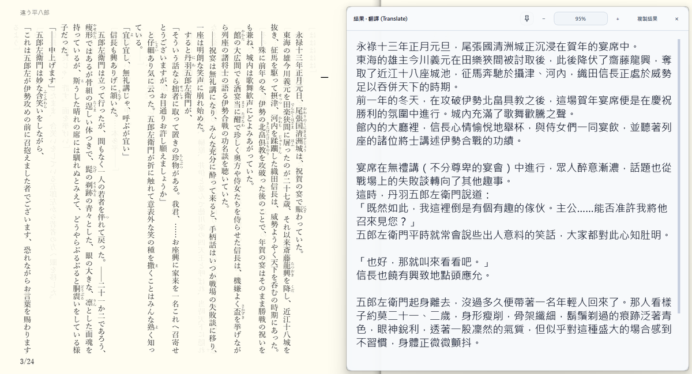
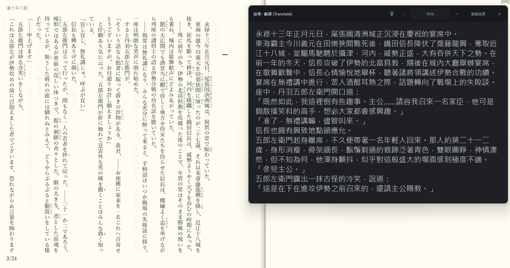
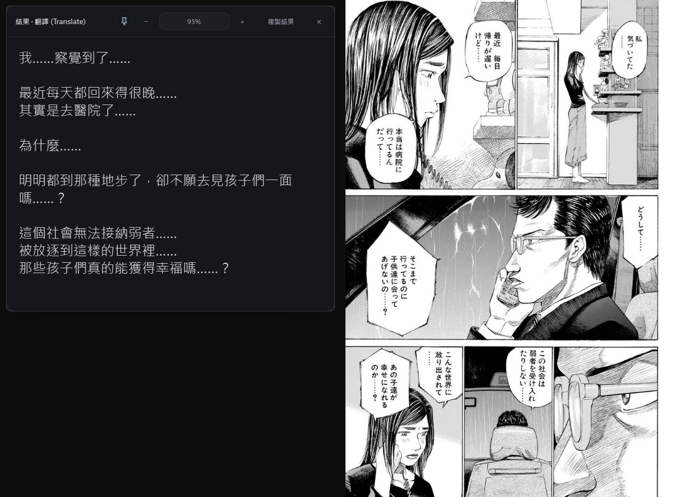

# OCRTranslator

繁體中文｜[简体中文](docs/README.zh-CN.md)｜[English](docs/README.en.md)

[](https://github.com/Lianye-Scythe/OCRTranslator/actions/workflows/ci.yml)
[](docs/packaging.md)
[](https://github.com/Lianye-Scythe/OCRTranslator/releases)
[](LICENSE)

OCRTranslator 是一款以 **桌面即時閱讀** 為核心的 **便攜式 OCR / AI 請求工具**。

它不是單純的截圖翻譯器，而是一個圍繞三種入口打造的桌面 AI 工作台：

1. **螢幕框選**：把截圖交給多模態模型做 OCR / 翻譯 / 解答 / 潤色
2. **選取文字**：擷取目前選取的文字，直接走文字請求
3. **手動輸入**：打開輸入框，把一段內容直接送給 AI

## 介面預覽

如果你想先快速掌握產品外觀，可以先看目前主視窗與翻譯浮窗的實際效果，再往下看功能總覽。

### 動態預覽

<p align="center">
  
</p>

### 靜態截圖

#### 主視窗

<p align="center">
  
  
</p>

#### 翻譯浮窗

<p align="center">
  
  
</p>
<p align="center">
  
  
</p>

## 特色總覽

- 支援 **截圖 / 選取文字 / 手動輸入** 三種請求入口
- 支援 **Prompt Preset** 方案系統，內建 `翻譯 (Translate)`、`解答 (Answer)`、`潤色 (Polish)`、`OCR 原文 (Raw OCR)` 四組預設方案
- 支援多個 API Profile，可接入 `Gemini Compatible` / `OpenAI Compatible`
- 支援多 Key 輪替、失敗重試與模型切換
- 流式回應預設啟用，可在進階設定中關閉；`Test API` 也會沿用相同模式驗證實際後端行為
- 第三方 Compatible 後端若不支援流式，會提示目前狀態並自動回退為非流式；流式中斷時也會保留部分結果與狀態標記
- 設定頁採用「連線與模型 → 翻譯方式與快捷鍵 → 介面與進階」三段式流程，較容易完成首次配置
- 應用內選取文字現在會優先直接讀取目前焦點控件的文字選區；若沒有可用的應用內選字，才回退到原本的系統剪貼簿擷取路徑
- 螢幕框選現在會先凍結桌面快照再裁切選區，降低高 DPI / 多螢幕偏移、hover 新 UI 混入與主視窗殘影
- 每次截圖都會重建新的選取遮罩，降低 Windows 上偶發閃出上一張截圖背景的機率
- 設定頁中的 `Fetch Models` / `Test API` / `Save Settings` 等動作按鈕已補上更穩定的焦點處理，避免 busy 狀態切換時把頁面自動捲到底
- 左右模式下的結果浮窗現在會更準確地量測標題與工具列寬度，首次顯示時更不容易壓到選區
- 流式圖片翻譯的浮窗更新策略已進一步穩定：首次 partial 會先根據選區可用空間預估寬度，降低冷啟動第一次截圖時的橫向跳位，持續更新時也會盡量避免靠近底部時的抖動
- 請求流程盡量維持非阻塞，並以應用內短時氣泡 / 系統匣通知回饋目前狀態
- 結果浮窗支援：
  - 複製、圖釘固定 / 取消固定
  - 只調整表面背景的透明度（文字保持清晰）
  - 直接輸入透明度百分比
  - 拖曳移動與角落拖曳改尺寸
  - `Ctrl + 滑鼠滾輪` 縮放字體
- 已 Pin 的結果浮窗可保留位置與尺寸；未 Pin 狀態則會根據當前場景動態展開，手動調整的寬度只在本次執行期間保留，不會跨重啟寫回設定檔
- 內建 `翻譯 (Translate)` 預設方案已更新為更中性的 OCR / 翻譯提示詞，若後端安全規則僅攔截局部內容，會以 `[REDACTED]` 替換觸發片段並盡量完成其餘翻譯
- 支援 `淺色 / 深色 / 跟隨系統` 三態主題切換
- 支援全域快捷鍵、系統匣、單實例喚回與 `--capture` 快速啟動
- 進階設定新增可切換的除錯 Log；預設只保留一般使用者可理解的執行紀錄，開啟後才會額外顯示定位診斷、截圖規劃與 API 底層重試細節
- 提供版本化 ZIP 發佈、`SHA256SUMS.txt` 校驗與完整三語文件

## 發佈與信任資訊

- 官方桌面發佈以 GitHub Releases 的版本化 ZIP 為準：`OCRTranslator-v<version>-windows-x64.zip`
- 推送 `v*` annotated tag 後，GitHub Actions 會自動建置 Release，並優先沿用 tag annotation 作為 Release 正文
- 目前公開 Windows 發佈包 **尚未簽名**；倉庫已預留 SignPath / Trusted Build 整合，後續計畫導入正式簽名流程
- 公開 Release 不會額外上傳獨立 `.exe`，而是只提供版本化 ZIP 與 GitHub 自帶 source archives
- Release 也會額外附上 `SHA256SUMS.txt`，方便手動校驗下載的 ZIP 檔案
- 若要私下回報敏感安全問題，請寄信到 `po12017po@gmail.com`

## 預設快捷鍵

當 `config.json` 不存在或欄位缺失時，預設快捷鍵如下：

| 動作 | 預設快捷鍵 |
|---|---|
| 螢幕框選 | `Shift + Win + X` |
| 選取文字 | `Shift + Win + C` |
| 手動輸入 | `Shift + Win + Z` |

> 實際使用時仍以你的 `config.json` 為準。

## 快速開始

### 1. 安裝依賴

```bash
python -m venv .venv
.venv\Scripts\activate
pip install -r requirements.txt
```

如果你還需要打包或維護開發工具：

```bash
pip install -r requirements-dev.txt
```

### 2. 啟動應用

#### 方式 A：推薦雙擊啟動

直接執行：

- `start.bat`

它會自動：

1. 檢查 `.venv`
2. 按需安裝執行依賴
3. 透過 `launcher.pyw` 啟動 GUI
4. 啟動期若出錯，優先顯示錯誤對話框

#### 方式 B：命令列啟動

```bash
python launcher.pyw
```

或：

```bash
python -m app.main
```

#### 方式 C：要求既有實例直接進入截圖

```bash
python -m app.main --capture
```

支援參數：

- `--capture`
- `/capture`
- `capture`

## 使用流程

### 1. 先完成目前設定檔的連線與模型測試

設定頁現在會優先引導你完成「連線與模型」區塊，至少需填寫：

- Provider
- Base URL
- API Keys
- Model

建議順序：

1. 選擇或新增一個 API Profile
2. `Fetch Models`
3. `Test API`
4. `Save Settings`

等連線完成後，再視需求補上：

- Target Language
- Global Hotkeys
- Prompt Preset
- Overlay 偏好
- Theme / UI Language

### 2. 從三種入口發起請求

你可以透過這些入口觸發：

- 主畫面的 `Start Capture`
- 主畫面的 `Open Input Box`
- 選取文字快捷鍵
- 托盤選單中的截圖 / 輸入框入口
- 對應的全域快捷鍵
- 選取文字快捷鍵在擷取期間不會再同步卡住主視窗；若擷取尚未完成，也可用 `取消目前操作` 中止
- `--capture` 啟動參數

### 3. 查看結果

- 截圖流程會在 `Preview & Log` 頁面顯示最近一次預覽
- 結果會以浮窗形式顯示在原文附近或觸發點附近
- 近期版本的圖片請求日誌會額外輸出 PNG 大小與 `capture / request / total` 耗時，方便確認性能瓶頸
- 執行過程會寫入記憶體日誌，可在介面中查看或匯出

## Prompt Preset

每組方案都包含：

- `image_prompt`
- `text_prompt`

支援變數：

- `{target_language}`

文字模式會把正文自動附加到提示詞後方，因此你只需要維護「指令部分」。

### 內建方案

| 方案 | 用途 |
|---|---|
| `翻譯 (Translate)` | 把圖片或文字翻譯成目標語言 |
| `解答 (Answer)` | 對題目、問題、說明直接作答或解釋 |
| `潤色 (Polish)` | 把文字改寫成更自然流暢的目標語言 |
| `OCR 原文 (Raw OCR)` | 只回傳 OCR 原文，不翻譯、不潤色 |

> 內建方案不可直接刪除；若要做可刪除版本，建議先複製成自訂方案。

## 設定檔

預設會優先使用便攜設定檔 `config.json`。

路徑解析規則：

- 原始碼模式：若專案根目錄已有 `config.json`，就沿用它；若根目錄可寫且尚未存在設定檔，也會直接在根目錄建立
- 打包 exe：若 exe 同層已有 `config.json`，就沿用它；若 exe 目錄可寫且尚未存在設定檔，也會直接在 exe 同層建立
- 若便攜位置沒有設定檔，且當前執行目錄不可寫，則自動回退到使用者設定目錄：
  - Windows：`%LOCALAPPDATA%\OCRTranslator\config.json`
  - 其他環境 fallback：`~/.ocrtranslator/config.json`

只要便攜設定檔存在，就會優先使用便攜路徑。

主要保存內容：

- Target Language / UI Language
- Theme Mode
- 三組全域快捷鍵
- Overlay 字型 / 字級 / 透明度 / Pin / 預設尺寸 / Pin 幾何
- 是否按 X 最小化到系統匣
- 目前啟用的 API Profile
- 目前啟用的 Prompt Preset
- 所有 Profiles / Presets

參考範例：

- `config.example.json`

> `config.json` 可能包含 API Keys 與私有 Base URL，請勿直接分享。
> crash log 仍會優先寫回專案根目錄或 exe 同層，不跟著 fallback 設定檔路徑移動。

## 托盤、單實例與錯誤處理

### 單實例

應用會用鎖檔與本地 server 保證單實例。

重複啟動時：

- 普通啟動：喚回既有主視窗
- `--capture`：喚回既有實例並直接開始截圖

### 托盤

托盤選單提供：

- 顯示主視窗
- 開始截圖
- 開啟輸入框
- 取消目前操作
- 退出程式

> 「選取文字」流程更適合透過全域快捷鍵觸發。
> 因為一旦從主視窗或托盤點擊，焦點通常會被本程式搶走，反而破壞外部應用原本的選取狀態。

預設情況下，右上角 `X` 會直接退出程式。
若希望 `X` 改成最小化到系統匣，可在設定頁啟用對應選項。

### 日誌與 Crash Log

- 執行日誌預設只保存在記憶體中
- 最多保留最近 100 筆
- 可從介面匯出

若程式遇到未處理例外，會在根目錄或 exe 同層生成：

```text
ocrtranslator-crash-YYYYMMDD-HHMMSS-xxxxxxxxx.log
```

## 測試與檢查

執行測試：

```bash
python -m unittest discover -v
```

基本編譯檢查：

```bash
python -m compileall app tests launcher.pyw
```

## 文件導覽

- [文件總覽](docs/index.md)
- [架構說明](docs/architecture.md)
- [開發指南](docs/development.md)
- [打包與發佈](docs/packaging.md)
- [常見問題 FAQ](docs/FAQ.md)
- [Code of Conduct](CODE_OF_CONDUCT.md)
- [Support](SUPPORT.md)
- [貢獻指南](CONTRIBUTING.md)
- [安全性回報](SECURITY.md)
- [變更記錄](CHANGELOG.md)

## 已知邊界

- 辨識與輸出品質高度依賴所接入的多模態模型
- 目前不內建離線 OCR 引擎
- 選取文字流程採用「模擬複製並盡量還原剪貼簿」策略，少數應用可能不響應標準複製行為
- 工程與啟動腳本主要面向 Windows 使用情境
- 浮窗定位以「盡量不遮擋閱讀」為優先，而非嚴格排版系統
- 執行日誌預設不做長期審計保存

## 授權條款

- 本專案採用 **GNU General Public License v3.0（GPLv3）** 發佈
- 詳細條款請見根目錄的 `LICENSE`
- 若你修改後再對外分發衍生版本，請一併提供對應原始碼並維持 GPLv3 授權

對外提交 Pull Request、補丁或其他程式碼貢獻時，預設也會以 GPLv3 納入本專案。
